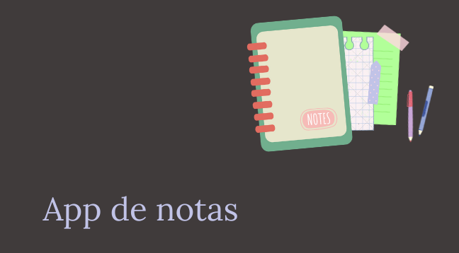

# APP DE NOTAS Tp 1

## Objetivo
Vamos a armar una app de tareas que nos permita guardar notas cortas utilizando las
herramientas que hasta el momento hemos aprendido.

## M2 C5

## Clase 10

## Ubicación -> Programación/TRABAJOS PRACTICOS/app de notas1